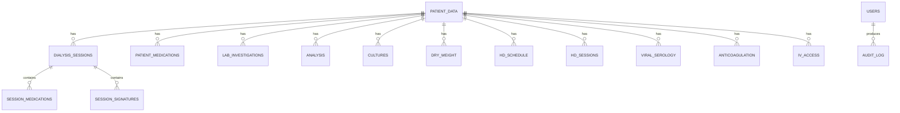

# Entity relationship overview

`backend/app/db/models.py` is authoritative. The current high-level relationships are:

Patient and session child relationships use cascading deletion. Audit records retain a nullable user reference when a user is removed.
